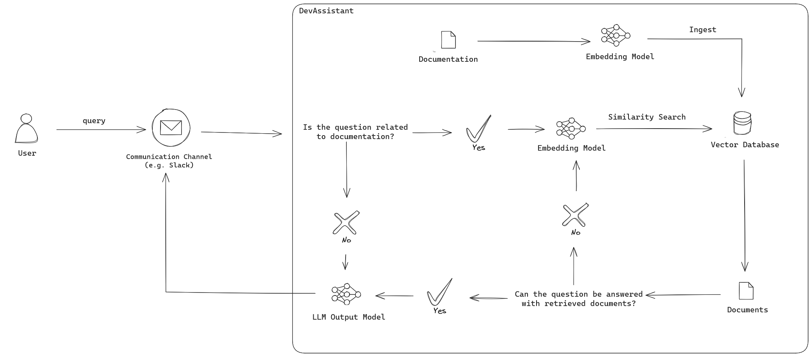
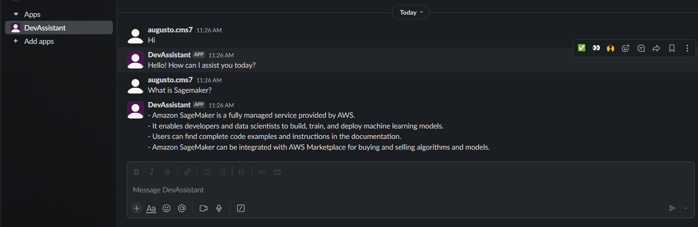

DevAssistant 
=====================================

## About:

DevAssistant is an LLM-powered chatbot designed to answer documentation 
related questions by retrieving the corresponding documents. It is 
intended to be integrated with the company communication channel 
(e.g. Slack), for a better user experience.

It implements a Retrieval Augmented Generation (RAG) pattern, in which
the documents are vectorized, indexed and stored in a vector store database.
An agent is used to decide if the user query is related to documentation
or not. If not, then the assistant generates a polite answer with its own
knowledge. If the question is about documentation, user query is embedded by 
the same model that embedded the documentation to the vector store database 
and a similarity searching algorithm is used to find the k-most similar 
documents. Then, the agent decides if the retrieved documents can answer the
user question. If not, it queries the vector database again at most 3 times. 
When the agent decides that the retrieved context can answer the question, 
a LLM model generates the final answer.

An image of the system architecture follows:



## Requirements:

- poetry
- llama-index
- chromadb
- ollama (for local LLM)
- slack-bolt (for Slack integration)

## Frameworks:

The following frameworks were used in this prototype:
- [LlamaIndex](https://www.llamaindex.ai/)
- [Ollama](https://ollama.com/)
- [ChromaDB](https://www.trychroma.com/)
- [Slack](https://slack.com/)

## Setup

First, set the environment variables to choose the LLM, embedding model,
documentation path and database path. If using Slack integration or GPT-3
as the LLM model, slackbot tokens (bot and app tokens) and openai key 
must also be set, respectively. A mock .env file with required variables 
is available in the file ``example.env``.

### Slack Integration

For Slack integration, DevAssistant needs the following permissions in
[Slack API](https://api.slack.com/)

1. Enable Socket Mode
2. Subscribe app to event: ``message.im`` 
3. Permission scopes:
    - ``channels:history``
    - ``im:history``
    - ``chat:write``

### Local LLM

For local LLM models (such as ``llama3``), we use Ollama as a framework for
making LLM requests. First, we need to pull the models we want to use
(in this example, ``llama3``):
```console
ollama pull llama3
```
Then, we need to start Ollama to be able to make API requests:
```console
ollama serve 
```

### DevAssistant

After setting the communication channel and LLM API, we can start
the system. We use ``poetry`` for managing python dependencies.

```console
cd challenge
poetry run python server.py
```

## Usage

With the server running, we can ask questions to DevAssistant through
direct messages:



## Evaluation

A jupyter notebook with a mockup of how to evaluate the LLM and embedding models 
can be seen in ``evaluations/models_evaluation.ipynb``. It serves as a guide to further
enhancing the performance of DevAssistant. It starts with a prompt engineering section,
where the prompts used in the query engine and the agent can be seen and updated, 
then it evaluates the retriever and response modules. Retriever and response
evaluation generates a synthetic query-response dataset and calculate respective metrics, 
such as relevancy and faithfulness for the response evaluation, and mean reciprocal rank 
(MRR) and Hit Rate for the retriever evaluation.

## Future Improvements

- Evaluating embedding and large language models
- Evaluating hyperparameters (e. g. chunk size)
- Dockerize the application
- Add possibility of joining channels and answering if mentioned
- New vector store database integrations (AWS Neptune, Pinecone, DeepLake, and so on)
